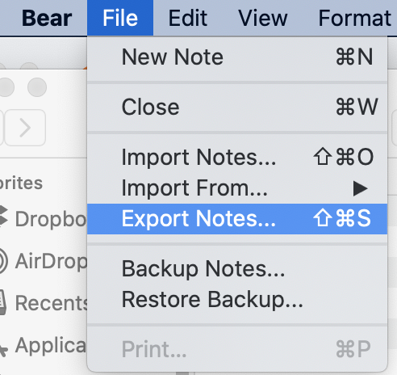
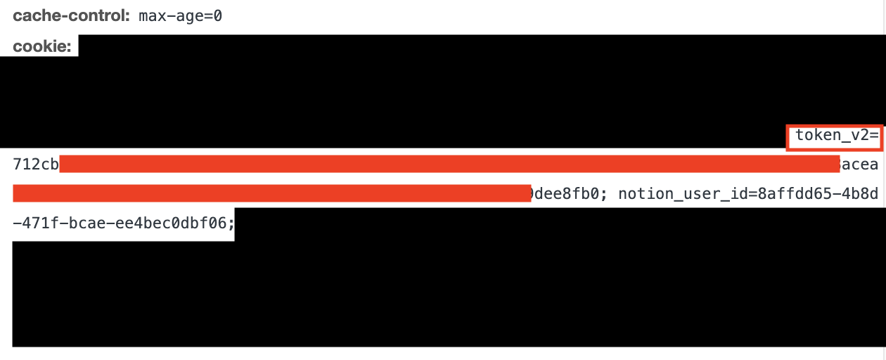
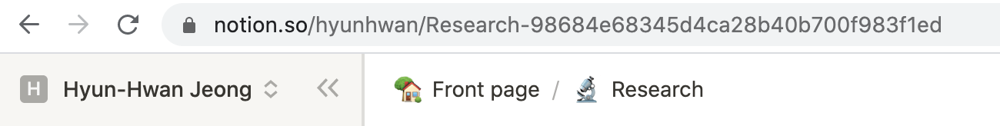

# bear-app-to-notion

This repository introduces how to import documents in [bear app](https://bear.app/) to [notion](https://https://bear.app/). The current notion import tool is limited because it can't import images. I did some research and wrote a script to import the bear app documents properly. The method has been tested in macOS with Python 3.8.3.

## Export bear notebook

First, it requires to export documents from bear app. It is possible to select to specific documents or a tag to export. 
The export format has to be markdown, and Export attachments option has to be **ON**.

<table>
    <tr>
        <td></td>
        <td></td>
    </tr>
    <tr>
        <td>Bear Menu</td>
        <td>The export attachment option after the export menu is selected</td>
    </tr>

</table>

## Run the script

After export, it needs to run a python script to import the exported markdown files to a notion page. [md2notion](https://github.com/Cobertos/md2notion) and [tqdm](https://github.com/tqdm/tqdm) python packages need to be installed.

```bash
pip install md2notion tqdm
```

Three variable in the first lines have to be set properly to run the script without any errors.

```py
token_v2 = "your_token_id"
page_url = "notion_url"
root_dir = "root_dir"
from notion.client import NotionClient
from md2notion.upload import upload
from notion.block import PageBlock
import io
from pathlib import Path
import glob
from tqdm import tqdm

client = NotionClient(token_v2=token_v2)
page = client.get_block(notion_url)
```

* The value of `token_v2` can be found from [by inspecting your browser cookies](https://github.com/jamalex/notion-py). In Chrome, **View->Developer->Developer tools->Network** will show the value.



* The value of `page_url` can be found from the url of the notion page.



* The value of `root_dir` has to be where the exported markdown files are located.

```py
for fname in tqdm(glob.glob("{root_dir}/**/*.md", recursive=True)):
    with open(fname, "r", encoding="utf-8") as mdFile:

        md_txt = mdFile.read().split("\n")
        page_title = md_txt[0].replace("#", "").strip()
        md_txt = "\n".join(md_txt[1:-1])

        mdFile = io.StringIO(md_txt)
        mdFile.__dict__["name"] = fname #Set this so we can resolve images later
        newPage = page.children.add_new(PageBlock, title=page_title)

        def convertImagePath(imagePath, mdFilePath):
            ret = Path(mdFilePath).parent / Path(mdFilePath).stem / Path(imagePath).name
            return ret
        upload(mdFile, newPage, imagePathFunc=convertImagePath)
```
